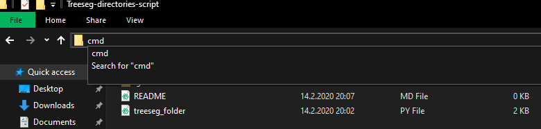

# Description
This is a python script to make registered scan folder compatible for treeseg algorithm at https://github.com/apburt/treeseg

## Tutorial
Make sure you have python installed.
Clone this repository to your machine

```
git clone https://github.com/vietle94/Treeseg-directories-script.git
```

or just download this and then unzip.

Next, open the terminal inside the folder by typing

```
cmd
```
from the address bar and press enter.



Then type in

```
python treeseg_folder.py
```
and follow instructions. There will be two options:

- Type 0 to copy and make treeseg directories hierarchy from .rxp files in registered scan directory or

- Type 1 to rename .DAT files:'

## Recommended workflow

Use option 0 to create and copy files from registered scan folder in to a new folder, in order to upload to treeseg later

Then open RiSCAN Pro to extract .DAT files into a subfolder called matrix

Finally, run the script again and use option 1 to rename those .DAT files into correct format
